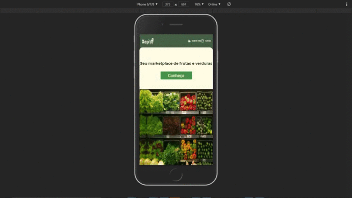

# xepa_inhalt :rocket:

Repositório responsável por armazenar o projeto desenvolvido durante o processo seletivo de estágio promovido pela _Inhalt Soluções_.

## Xepa 🍃

Pensando no caso de uso levantado no desafio e em como eu poderia entregar o máximo de valor possível para o cliente, veio a ideia da Xepa. A Xepa é uma plataforma marketplace que tem como intuito unir comerciantes que trabalham com a venda de frutas e verduras nas feiras, com os seus fregueses.

Com isso, a Xepa visa promover a micro-economia regional e ainda incentivar o consumo alimentar mais saudável.

Viemos atender os seguintes requisitos:

- Realizar Login
- Listar produtos cadastrados
- Realizar as vendas de produtos
- Filtrar os produtos cadastrados

# Antes de prosseguir, veja o vídeo demonstrativo da aplicação nesse link:

[LINK DO VIDEO COM ÁUDIO EXPLICATIVO ASSISTA!!](https://www.youtube.com/watch?v=ZdvgQbtXqwQ&feature=youtu.be)

## Versão Web da aplicação

## Versão responsiva da aplicação

## Observações gerais

Toda a experiência de desenvolvimento da aplicação foi muito gratificante. Tenho a certeza de ter aprendido bastante com o todo processo.

Antes de dar continuidade, gostaria de fazer algumas observações sobre o desafio. A priori, a proposta de desenvolvimento da parte back-end do desafio foi idealizada para ser realizada utilizando C#, fato este que quase me fez desistir do processo. Tal motivo, é por eu nunca ter utilizado essa linguagem antes, apesar de saber desenvolver APIs REST utilizando outras tecnologias. No fim, optei por desenvolver o back-end do projeto utilizando Typescript e NodeJS, pois acredito que toda tecnologia serve apenas como meio para podermos chegar no objetivo final. Sobre as tecnologias exigidas, acredito que por conhecer os conceitos, a fase de aprender uma nova sintaxe é só questão de reiterada prática.

Outrossim, todo o projeto (front-end e back-end) foi desenvolvido com Typescript. Typescript é um superset do Javascript desenvolvido pela equipe da Microsoft que pega toda a linguagem tradicional do JS e adiciona tipagem. No final do processo, todo código é transpilado para Javascript, o que pode ser observado no diretório `./dist` presente na pasta `backend`, e no diretório `./build` presente na pasta `frontend`. O uso de tal tecnologia facilita muito o processo de desenvolvimento, e já está sendo implementado em grandes projetos.

Por fim, gostaria de agradecer a oportunidade de participar deste processo que agregou bastante conhecimento. Espero em breve fazer parte da equipe.

## Tecnologias utilizadas :computer:

- Front-end:
  - ReactJS
  - Typescript
  - Axios
  - Context API
- Back-end:
  - NodeJS
  - Typescript
  - Knex
  - Sqlite3
  - JWT
  - Bcrypt

## Mais detalhes técnicos do desenvolvimento 👨‍💻

Para mais detalhes do desenvolvimento do back-end e front-end consultar o README das pastas [backend](./backend/README.md) e [frontend](./frontend/README.md).

## Como rodar o projeto :fire:

1. Clone o repositório
1. Execute o comando `npm install` para instalar todas as dependências nas pastas `backend` e `frontend`. Atentar para executar o comando em cada uma das pastas.
1. Execute o comando `npm run start` para iniciar o servidor nas pastas `backend` e `frontend`. Atentar para executar o comando em cada uma das pastas.
1. Abra o navegador no endereço `http://localhost:3000`.

Obs: Caso o banco de dados não funcionar executar os seguintes passos:

1. Execute o comando `npm run knex:migrate:rollback` na pasta `backend` para excluir as tabelas do bancos de dados.
1. Execute o comando `npm run knex:migrate` na pasta `backend` para inicializar as migrations novamente.
1. Execute o comando `npm run start` para inicializar o servidor novamente.

###### Com amor :heart: Samuel Santos
