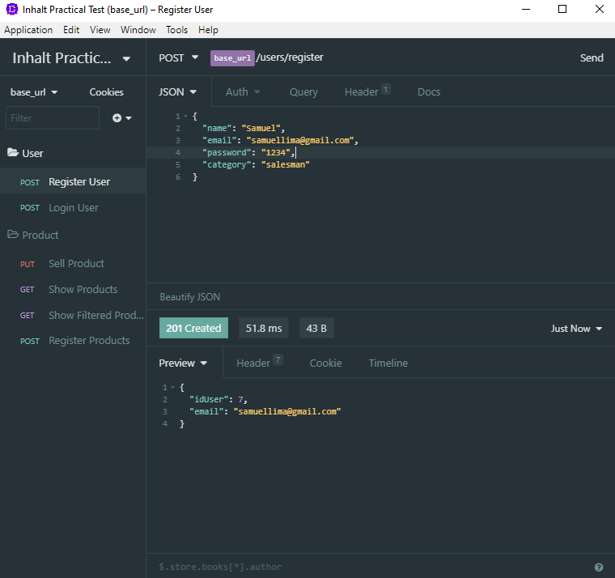
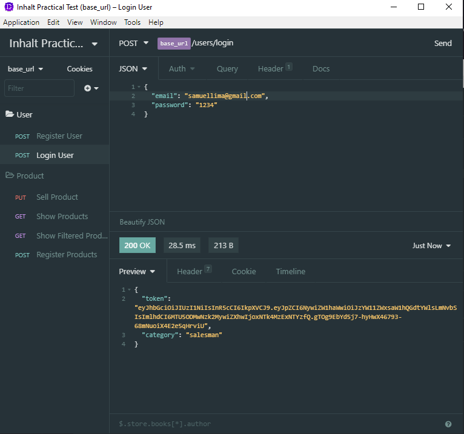
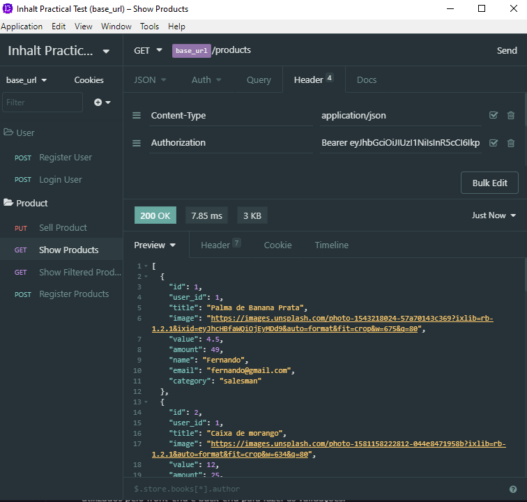
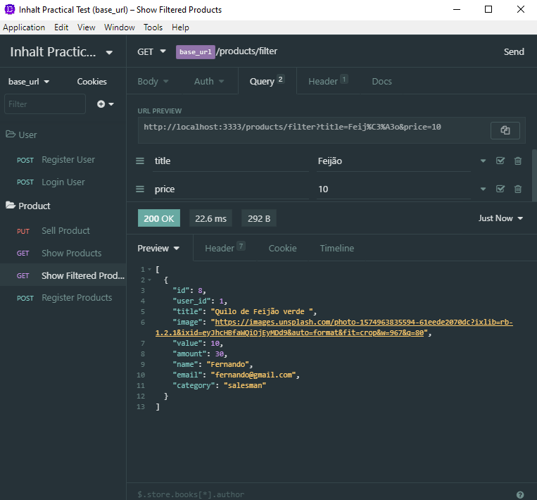
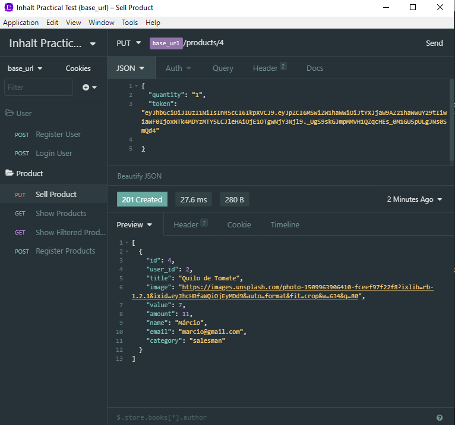
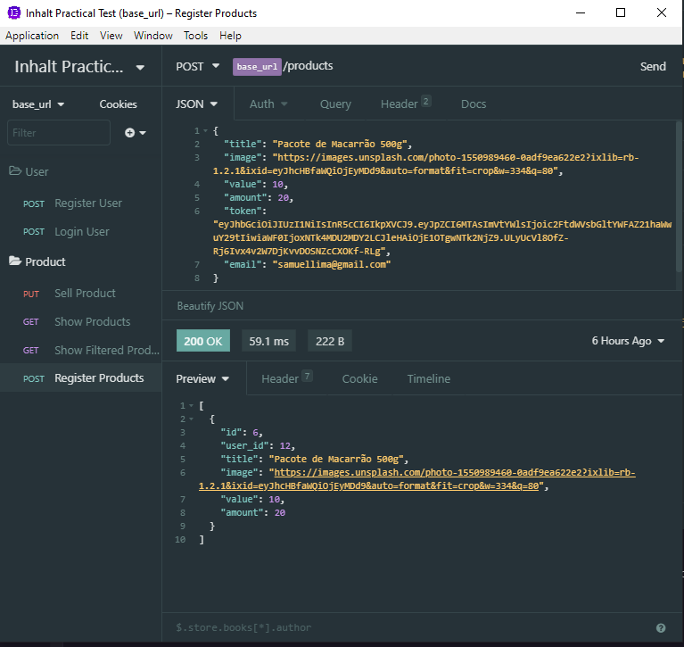

# Back-end

O back-end da aplicação tinha como objetivo atender os seguintes objetivos:

[x] - Realizar login
[x] - Listar os produtos cadastrados
[x] - Cadastrar novos produtos com nome, valor e quantidade em estoque
[x] - Realizar uma venda, o qual consiste em selecionar o produto e a quantidade vendida, o que deverá ser contabilizado no estoque.
[x] - Possibilidade de filtrar produtos cadastrados

Além disso, procurei dar o passo adicional e coloquei algumas novas funcionalidade como:

[x] - Cadastrar usuário
[x] - Categorias para os usuários
[x] - Validações JWT
[x] - Utilização de Migrations e Banco de dados

## Rotas e funcionalidade

A aplicação exigiu dois tipos de controllers, um responsável por gerenciar os dados do usuário e outro dos produtos.

### Rotas do usuário

- A rota `POST` `http://localhost:3333/users/register` é responsável por criar um novo usuário. Nela passamos no body da aplicação o nome, email. senha e a categoria do user. Obtemos como retorno apenas o email e o id do usuário.

;

- A rota `POST` `http://localhost:3333/users/login` é responsável por fazer o login do usuário na aplicação, dando o acesso as demais rotas da aplicação. No body passamos o email e senha, é retornado o token e a categoria, que serão utilizados pelo front-end e back-end para fazer as validações.

;

- A rota `GET` `http://localhost:3333/products` é responsável por mostrar todos os produtos cadastrados na plataforma. Como é visto, ela só é acessível se contiver nos headers o token JWT de autenticação do usuário.

- A rota `GET` `http://localhost:3333/products/filter` é responsável por mostrar todos os filtros de produtos. Esses filtros são feitos pelo título e pelo preço. Estes parâmetros são passados pelo Query Params.

- A rota `PUT` `http://localhost:3333/products/:id` é responsável por fazer a venda do produto. É passado como Route Param o id do produto. Nela enviamos no body a quantidade da venda e o token JWT da pessoa que solicitou a compra. A informação retornada são os dados do produto já atualizados.

- A rota `POST` `http://localhost:3333/products` é responsável por registrar um novo produto. Nela, apenas que pertence a categoria de vendedor que tem acesso a essa rota. Essa validação é feita a partir do email fornecido no body.
