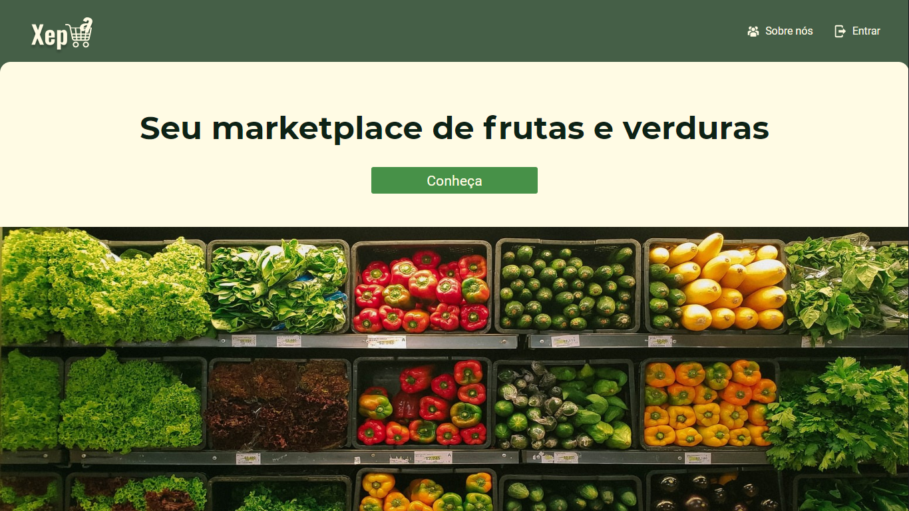
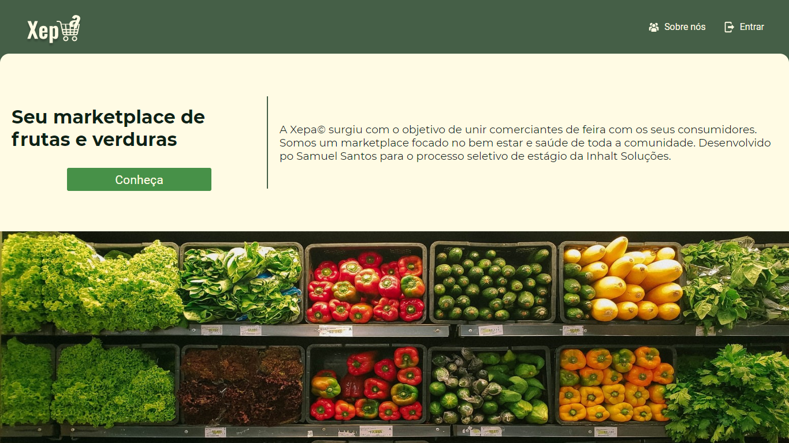
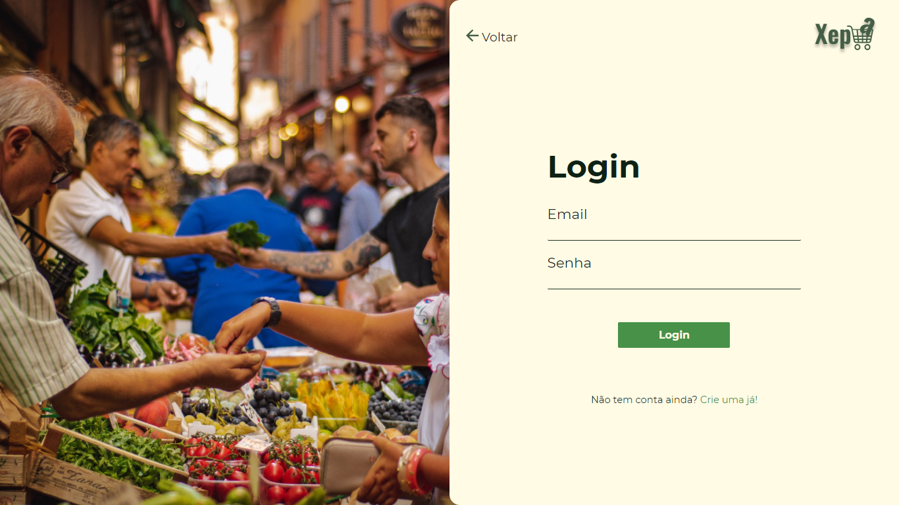
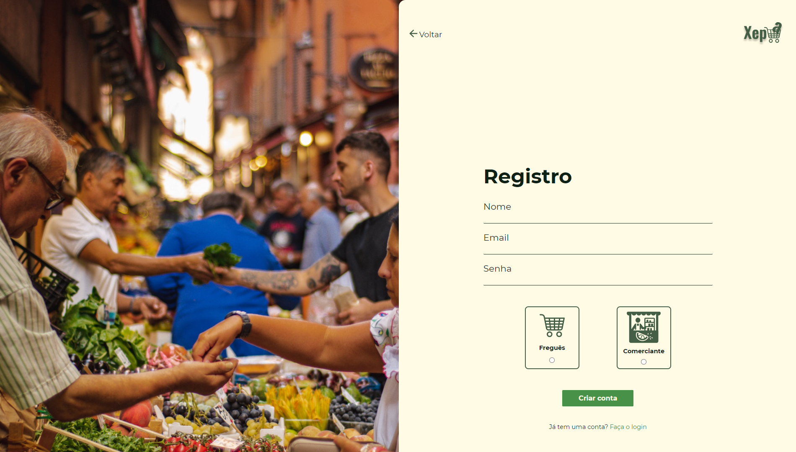

# Front-End

O Front-End da aplicação teve o objetivo de entregar todas as informações entregues pela API de forma bonita e agradável.

## Páginas

- Home

Na página home tentei ser o mais clean possível, apresentando apenas as informações essenciais. Caso o usuário queira saber um pouco mais sobre o projeto, ele pode também selecionar a opção do `Sobre nós`.

- Login

Na página de Login o usuário pode realizar o login ou selecionar a opção para cadastrar uma nova conta caso ele seja novo na plataforma.

- Registrar nova conta

Na página de registro o usuário pode criar uma nova conta e selecionar entre as nossas duas categorias: Freguês e Comerciante.

\*Produtos

Na página de produtos podemos ver todos os produtos cadastrados na plataforma após o login.

- Novo produto

Na página de novo produtos está presente o relatório para cadastrar novos produtos.

## Observações

Todos os dados estão consumidos diretamente da api. Todo o gerenciamento de login e autenticação foi feito através do Context Api. Todo o front-end foi desenvolvido com ReactJS e Typescript.
